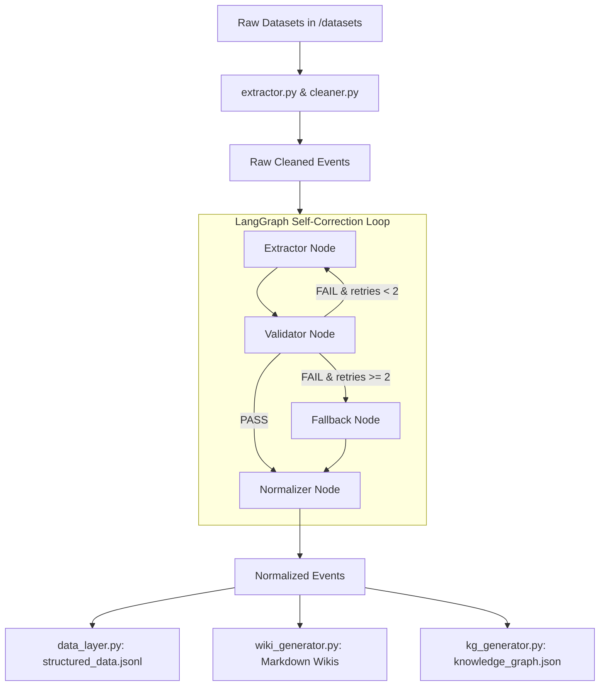
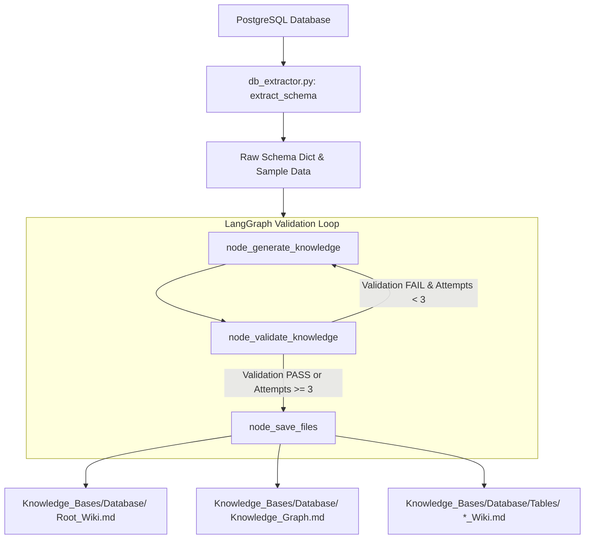
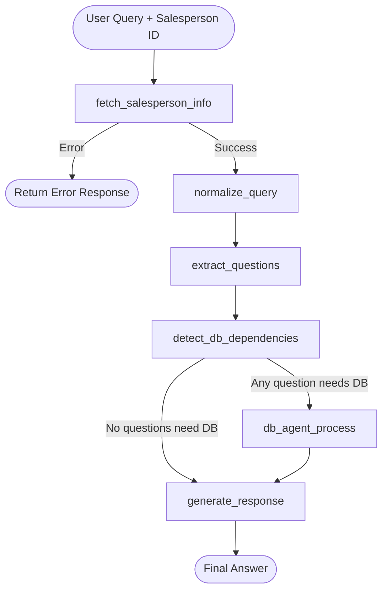
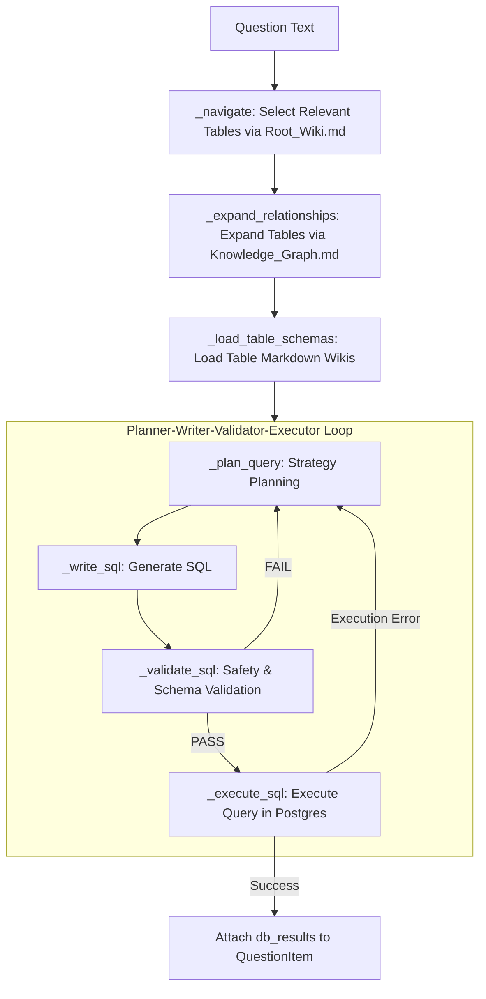
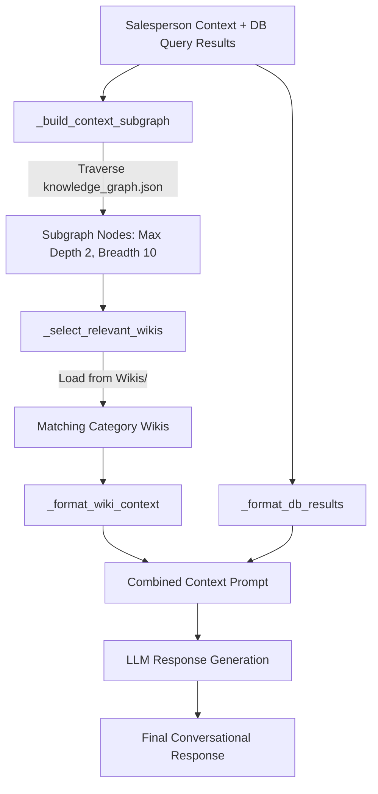

# Current System Architecture Specification: Sales AI Assistant

## 1. System Overview

The **Sales AI Assistant** is an enterprise intelligence system designed to process multi-source sales communication data (emails, calendar events, meeting transcripts) and relational database records into structured, queryable knowledge bases. It then executes an autonomous, multi-agent query pipeline to answer complex natural language questions posed by salespersons.

The system architecture is strictly modularized into three major operational subsystems supported by a shared infrastructure layer:

1. **Shared Infrastructure & LLM Utilities (`utils/`)**: Provider-agnostic LLM integration, token rotation, local model fallbacks, output parsing, and database connectivity.
2. **Knowledge Base Generation (`Knowledge_Base_Generation/`)**:
   - **Business Knowledge Generation**: An agentic extraction, verification, and normalization pipeline built on LangGraph that transforms raw datasets into organized Markdown Wikis, JSONL structured data, and a graph network.
   - **Database Knowledge Generation**: A PostgreSQL introspection agent that extracts database schemas and uses LangGraph to generate Root Wikis, Table Wikis, and schema relationship graphs.
3. **Query Pipeline (`Query_Pipeline/`)**: A stateful LangGraph orchestration pipeline that normalizes salesperson queries, extracts sub-questions, detects data dependencies, dynamically plans/validates/executes SQL queries against PostgreSQL, traverses business graph context, and synthesizes natural responses.

---

## 2. Infrastructure & Utility Layer (`utils/`)

The infrastructure layer abstracts model providers, database access, text sanitization, and structured JSON parsing across the application.

```
utils/
├── llm.py           # Universal entry point for LLM execution
├── huggingface.py   # Multi-token HuggingFace Inference API router
├── ollama.py        # Local Ollama (deepseek-r1:8b) connector
├── parser.py        # Text cleaning, normalization, and repair JSON parser
├── db.py            # PostgreSQL connection manager (psycopg2)
└── LLMs.json        # Model configuration registry
```

### 2.1 Unified LLM Abstraction (`utils/llm.py`)
- Reads `LLM_PROVIDER` ("huggingface" or "ollama") from `.env` (defaults to `huggingface`).
- Exposes `invoke_llm(model_names: list[str], prompt: str, parse_as_json: bool = False) -> Any`.
- Routes calls to either the HuggingFace engine or local Ollama engine.

### 2.2 HuggingFace Multi-Token Engine (`utils/huggingface.py`)
- **Token Rotation & Failover**: Accepts comma-separated HuggingFace API tokens via `HF_TOKENS` in `.env`. Tracks exhausted tokens (`_exhausted_token_indices`) upon encountering rate limit, quota, 429, or payment errors, automatically rotating to the next available token index.
- **Model Fallback List**: Iterates through a prioritized list of model aliases (defined in `utils/LLMs.json`, e.g., `llama3_3_70b`, `deepseek_v3`, `qwen2_5_72b`). If a model encounters client errors (400, 404, 422), it skips to the next model.
- **Network Retries**: Implements exponential backoff retries (up to 3 attempts) for transient network failures.
- **LangChain Integration**: Instantiates `HuggingFaceEndpoint` and `ChatHuggingFace` dynamically based on model task configuration ("text-generation" vs "conversational").

### 2.3 Local Ollama Integration (`utils/ollama.py`)
- Connects to local Ollama server running `deepseek-r1:8b` with `temperature=0.6` and `keep_alive=-1`.
- Provides `start_connection()` to pre-initialize the model connection during system startup.
- Retries invocation up to 3 times with exponential backoff on execution errors.

### 2.4 Text Sanitization & Robust JSON Parsing (`utils/parser.py`)
- **`clean_text(raw_text)`**:
  - Handles string, dict, or LangChain `AIMessage` inputs.
  - Performs HTML unescaping.
  - Strips LLM reasoning tags (`<think>...</think>`).
  - Normalizes smart quotes, non-breaking characters, and unicode (NFKC).
  - Removes common LLM preamble/postamble prefixes (e.g., *"here is the cleaned text:"*).
- **`extract_json(raw_text)`**:
  - Cleans input text and strips markdown code fences (` ```json `).
  - Uses regex location matching to isolate top-level `{ ... }` JSON strings.
  - Implements syntax repair via `fix_invalid_json_syntax` (fixing trailing commas, single-quoted keys).
  - Recursively sanitizes extracted JSON data via `sanitize_data`.
  - Fallback logic checks for string indicators (`VERIFYABLE` / `UNVERIFYABLE`) if JSON extraction fails.

### 2.5 Database Access (`utils/db.py`)
- Implements `init_db() -> psycopg2.extensions.connection`.
- Validates environment variables (`DB_HOST`, `DB_NAME`, `DB_USER`, `DB_PASSWORD`, `DB_PORT`).
- Establishes connection using `psycopg2`.

---

## 3. Knowledge Base Generation Subsystem (`Knowledge_Base_Generation/`)

```
Knowledge_Base_Generation/
├── Business_Knowledge_Generation/
│   ├── main.py             # Pipeline execution entry point
│   ├── extractor.py        # Dataset loading & field extraction
│   ├── cleaner.py          # Raw text cleaning (HTML, WEBVTT)
│   ├── agent_workflow.py   # LangGraph state machine workflow
│   ├── agents.py           # Extractor, Validator, Normalizer agents
│   ├── data_layer.py       # JSONL persistence
│   ├── wiki_generator.py   # Markdown Wiki generation (OKF format)
│   └── kg_generator.py     # Graph network builder (nodes & edges)
└── Database_Knowledge_Generation/
    ├── main.py             # DB Knowledge generation entry point
    ├── agent_workflow.py   # LangGraph orchestration graph
    ├── db_extractor.py     # PostgreSQL schema introspection
    └── llm_generator.py    # Root Wiki, Table Wiki, Knowledge Graph LLM generators
```

### 3.1 Business Knowledge Base Generation Flow

The Business Knowledge Base Generation module reads raw sales datasets from `datasets/` (`data_calendar_event.json`, `data_emails.json`, `data_meets.json`) and converts them into structured knowledge artifacts in `Knowledge_Bases/Business/`.



#### Step 1: Raw Data Ingestion & Sanitization (`extractor.py`, `cleaner.py`)
- Loads JSON datasets.
- **Emails (`extract_emails`)**: Parses email content, dates, and participants. Sanitizes HTML body via `clean_email_body` (strips HTML tags and unescapes entities).
- **Calendar Events (`extract_calendar_events`)**: Parses event body, organizer, and attendee email addresses. Sanitizes body via `clean_event_body`.
- **Meeting Transcripts (`extract_transcripts`)**: Extracts WEBVTT transcripts. Sanitizes transcript via `clean_meeting_transcript` (removes `WEBVTT` headers, timestamp ranges `00:00:00.000 --> ...`, speaker tags `<v Name>`). Preserves metadata (`projectName`, `customerName`).

#### Step 2: Agentic Self-Correction Loop (`agent_workflow.py`, `agents.py`)
Orchestrated using **LangGraph** (`StateGraph(EventState)`):

- **`EventState` Schema**:
  `raw_event`, `cleaned_data`, `extracted_entities`, `validation_status`, `validation_feedback`, `retry_count`, `normalized_event`.
- **Extractor Node (`extractor_agent`)**: Prompts LLMs (`llama3_3_70b`, `deepseek_v3`, `qwen2_5_72b`) to extract strictly factual entities (`event_type`, `participants`, `customer`, `project`, `salesperson`, `summary`). Injects `validation_feedback` on retry iterations.
- **Validator Node (`validator_agent`)**: Fact-checker agent using `veritas_8b_fact_checker`, `deepseek_r1`, `llama3_3_70b`. Compares extracted entities against original source text to prevent AI hallucinations. Returns `{"valid": bool, "feedback": str}`.
- **Routing Logic (`route_validation`)**:
  - `validation_status == PASS` $\rightarrow$ `normalizer`
  - `validation_status == FAIL` and `retry_count < 2` $\rightarrow$ `extractor` (re-prompting with error feedback)
  - `validation_status == FAIL` and `retry_count >= 2` $\rightarrow$ `fallback`
- **Fallback Node**: Populates entity fields from raw metadata defaults to prevent data loss.
- **Normalizer Node (`normalizer_agent`)**: Standardizes entity values, canonicalizes names, enforces `event_type` enum (`mail`, `meeting`, `calendar_event`), and appends `complete_cleaned_data`.

#### Step 3: Knowledge Base Artifact Generation
- **Structured Data (`data_layer.py`)**: Writes normalized event dictionaries to `Knowledge_Bases/Business/Structured_Data/structured_data.jsonl`.
- **Wikis (`wiki_generator.py`)**: Generates Markdown wiki files with YAML frontmatter across five subdirectories:
  - `Salespersons/`: `<salesperson_name>.md`
  - `Customers/`: `<customer_name>.md`
  - `Projects/`: `<project_name>.md`
  - `People/`: `<person_identifier>.md`
  - `Events/`: `<event_id>.md`
  Supports incremental updates, reading pre-existing wikis, and updating frontmatter lists (`customers`, `projects`, `meetings`, `emails`, `calendar_events`).
- **Knowledge Graph (`kg_generator.py`)**: Builds a graph network saved to `Knowledge_Bases/Business/knowledge_graph.json`.
  - **Nodes**: `Event`, `Salesperson`, `Customer`, `Project`, `Person`.
  - **Edges**: `PARTICIPATED_IN`, `MANAGES`, `OWNS`, `HAS_PROJECT`, `INVOLVED_IN`, `HAS_EVENT`, `ATTENDED`, `BELONGS_TO`.

---

### 3.2 Database Knowledge Base Generation Flow

Extracts relational schema information from the PostgreSQL live database and uses LangGraph to synthesize verified documentation.



#### Step 1: PostgreSQL Schema Extraction (`db_extractor.py`)
- Connects to PostgreSQL using `utils/db.py`.
- Queries `information_schema.tables` for `public` base tables.
- For each table:
  - Extracts column names and data types from `information_schema.columns`.
  - Samples up to 5 non-null distinct sample values per column (ordered by `updated_at DESC` if available).
  - Queries `pg_index` and `pg_attribute` for primary keys.
  - Queries `information_schema.table_constraints` and `key_column_usage` for foreign key relationships (`column`, `foreign_table`, `foreign_column`).

#### Step 2: Agentic Documentation & Validation Workflow (`agent_workflow.py`, `llm_generator.py`)
Orchestrated via LangGraph (`GraphState`):

- **`node_extract_schema`**: Invokes `db_extractor.py` and initializes state.
- **`node_generate_knowledge`**:
  - `generate_root_wiki`: Generates high-level schema overview and business purposes using `GEN_MODELS` (`qwen2_5_72b`, `llama3_3_70b`).
  - `generate_table_wiki`: Generates detailed table documentation including column types, business uses, PKs, FKs, and real sample values.
  - `generate_knowledge_graph`: Generates markdown table-to-table and column-to-column relationship graph tracing paths up to 4 hops using `GRAPH_MODELS` (`deepseek_r1`, `llama3_3_70b`, `qwen2_5_72b`).
- **`node_validate_knowledge`**: Uses `VALIDATION_MODELS` (`veritas_8b_fact_checker`, `deepseek_v3`, `llama3_3_70b`) to compare generated Markdown against raw schema to detect hallucinations.
- **Conditional Edge (`conditional_edge`)**: Retries generation up to 3 attempts if validation fails.
- **`node_save_files`**: Purges existing `Knowledge_Bases/Database/` directory and writes `Root_Wiki.md`, `Knowledge_Graph.md`, and individual `Tables/<table_name>_Wiki.md` files.

---

## 4. Query Pipeline Subsystem (`Query_Pipeline/`)

The Query Pipeline is the primary runtime engine for handling user inquiries. It receives a `salesperson_id` and a natural language `query`, processes the input through a multi-agent LangGraph workflow, retrieves SQL database data and Business KB context, and synthesizes a natural response.

```
Query_Pipeline/
├── main.py                 # Pipeline entry point & test harness
├── state.py                # PipelineState & TypedDict state models
├── workflow.py             # Main LangGraph graph definition
├── query_optimizer.py      # Salesperson fetch, Query Normalizer, Question Extractor
├── db_dependency.py        # Database dependency detector agent
├── db_agent.py             # Autonomous SQL agent (Navigate -> Expand -> Plan -> Write -> Validate -> Execute)
├── kb_loader.py            # Utility file loaders for Database & Business Knowledge Bases
└── response_generator.py   # Business graph traversal, Wiki context loader & Response LLM synthesizer
```

### 4.1 Pipeline Execution Graph (`workflow.py`, `state.py`)



#### Pipeline State Definition (`state.py`)
- `PipelineState`:
  - `salesperson_id`: string
  - `raw_query`: string
  - `salesperson_info`: dict (profile, email, role, list of projects)
  - `normalized_query`: string
  - `questions`: list of `QuestionItem` (`index`, `text`, `needs_db`, `db_results`)
  - `final_response`: string
  - `error`: string

---

### 4.2 Query Processing Nodes

#### Node 1: Salesperson Fetch (`query_optimizer.py` $\rightarrow$ `node_fetch_salesperson_info`)
- Queries PostgreSQL `salespersons` table for `id`, `name`, `email`, `role`.
- Queries `projects` table for active projects associated with the salesperson (`salesperson = id`).
- If salesperson is not found, populates `state["error"]` and terminates pipeline early.

#### Node 2: Query Normalization (`query_optimizer.py` $\rightarrow$ `node_normalize_query`)
- Resolves relative dates ("last week", "yesterday", "this week") to absolute ISO date strings (`YYYY-MM-DD`) using system clock.
- Normalizes measurement/currency units.
- Strips filler speech words ("um", "like", "you know").
- Resolves pronouns ("I", "my", "me") to salesperson name and project context.
- Uses `OPTIMIZER_MODELS` (`llama3_3_70b`, `qwen2_5_72b`, `deepseek_v3`).

#### Node 3: Question Extraction (`query_optimizer.py` $\rightarrow$ `node_extract_questions`)
- Decomposes normalized query into independent sub-questions while preserving original sequence.
- Ensures project/salesperson context is explicitly injected into every sub-question.
- Outputs structured JSON list of questions.

#### Node 4: DB Dependency Detection (`db_dependency.py` $\rightarrow$ `node_detect_db_dependencies`)
- Evaluates sub-questions against DB table schema (`salespersons`, `projects`, `events`).
- Determines whether each question requires querying PostgreSQL (`needs_db: true/false`).
- *(Note: Currently has a temporary test override setting `needs_db = False` for debugging, with exception fallback to `True`).*

---

### 4.3 Autonomous DB Agent Subsystem (`db_agent.py`)

When DB dependencies exist, `node_db_agent_process` executes an internal 6-stage sub-workflow for each question needing database retrieval:



#### Detailed Operations in `db_agent.py`:
1. **Navigator (`_navigate`)**:
   - Reads `Knowledge_Bases/Database/Root_Wiki.md` via `kb_loader.py`.
   - Uses `NAVIGATOR_MODELS` to identify initial target tables required for the query.
2. **Relationship Expander (`_expand_relationships`)**:
   - Parses `Knowledge_Bases/Database/Knowledge_Graph.md` markdown tables.
   - Discovers explicit foreign key relationships and automatically adds missing joined tables to the query scope (`expanded_tables`).
3. **Schema Loader (`_load_table_schemas`)**:
   - Loads specific `Knowledge_Bases/Database/Tables/<table_name>_Wiki.md` documentation for all expanded tables.
4. **Planner (`_plan_query`)**:
   - Prompts `PLANNER_MODELS` (`llama3_3_70b`, `qwen2_5_72b`, `deepseek_r1`) to formulate a plain-text read-only SQL plan.
   - Enforces filtering by `salesperson_id`, project name matching, date filtering via `created_at`, and event type enum filtering ('calendar_event', 'mail', 'meeting'). Re-injects error feedback on retries.
5. **SQL Writer (`_write_sql`)**:
   - Converts the plan into a PostgreSQL SQL query using `WRITER_MODELS`.
   - Strips code fences and semicolons to output a clean statement.
6. **SQL Validator (`_validate_sql`)**:
   - **Mutation Check**: Regex searches for `INSERT`, `UPDATE`, `DELETE`, `DROP`, `TRUNCATE`, `ALTER`, `CREATE`, `GRANT`, `REVOKE`, `EXEC`, `MERGE`, `UPSERT`.
   - **Statement Check**: Confirms query starts with `SELECT` or `WITH` and enforces a single statement.
   - **Schema Check**: Validates that all referenced tables belong to `KNOWN_TABLES` (`salespersons`, `projects`, `events`) and referenced columns exist in `KNOWN_COLUMNS`.
7. **SQL Executor (`_execute_sql`)**:
   - Connects to PostgreSQL, executes query using `RealDictCursor`, retrieves column names and rows, and stringifies complex non-serializable fields.

---

### 4.4 Multi-Modal Context Assembly & Response Synthesis (`response_generator.py`)

`node_generate_response` compiles data from both the relational database and the business knowledge base:



1. **Graph Traversal (`_build_context_subgraph`)**:
   - Loads `Knowledge_Bases/Business/knowledge_graph.json`.
   - Seeds BFS search with salesperson name, customer names, and project names.
   - Traverses adjacent graph nodes up to a maximum depth of 2 and breadth of 10 nodes.
2. **Wiki Context Loading (`_select_relevant_wikis`)**:
   - Iterates through `Knowledge_Bases/Business/Wikis/` categories (`Salespersons`, `Customers`, `Projects`, `Persons`, `Events`).
   - Loads wikis corresponding to discovered graph nodes or associated salesperson metadata.
3. **Context Formatting**:
   - `_format_wiki_context`: Transforms raw markdown wikis into human-readable interaction summaries (converting raw event types to "Meeting" or "Email", formatting ISO dates to readable text, extracting participants and summaries).
   - `_format_db_results`: Transforms SQL row output into readable text key-value blocks.
4. **LLM Synthesis (`RESPONSE_MODELS`: `llama3_3_70b`, `qwen2_5_72b`, `deepseek_v3`)**:
   - Generates a single, cohesive, conversational response speaking directly to the salesperson.
   - Strictly forbids technical jargon, internal IDs/UUIDs, database terms, or mentions of wikis/graphs.

---

## 5. Live Database Schema & Workspace Artifact Layout

### 5.1 PostgreSQL Relational Schema

The PostgreSQL database consists of 3 primary tables in the `public` schema:

```
+-----------------------------------------------------------------------------------+
|                                 salespersons                                      |
+-------------------+-------------------+-------------------------------------------+
| Column            | Type              | Constraints / Info                        |
+-------------------+-------------------+-------------------------------------------+
| id                | uuid              | PRIMARY KEY, default gen_random_uuid()    |
| name              | varchar(255)      | NOT NULL                                  |
| email             | varchar(255)      | UNIQUE, NOT NULL                          |
| role              | salesperson_role  | ENUM ('sales_rep', 'senior_sales_rep',    |
|                   |                   | 'sales_manager', 'sales_director', 'admin')|
| projects          | text[]            | Array of project names                    |
| created_at        | timestamptz       | default CURRENT_TIMESTAMP                 |
| updated_at        | timestamptz       | default CURRENT_TIMESTAMP                 |
+-------------------+-------------------+-------------------------------------------+

+-----------------------------------------------------------------------------------+
|                                   projects                                        |
+-------------------+-------------------+-------------------------------------------+
| Column            | Type              | Constraints / Info                        |
+-------------------+-------------------+-------------------------------------------+
| id                | uuid              | PRIMARY KEY, default gen_random_uuid()    |
| project_name      | varchar(255)      | NOT NULL                                  |
| customer_name     | varchar(255)      | NOT NULL                                  |
| salesperson       | uuid              | FOREIGN KEY -> salespersons(id)           |
| status            | varchar(100)      | Deal status ('Active', 'In Progress', etc)|
| created_at        | timestamptz       | default CURRENT_TIMESTAMP                 |
| updated_at        | timestamptz       | default CURRENT_TIMESTAMP                 |
+-------------------+-------------------+-------------------------------------------+

+-----------------------------------------------------------------------------------+
|                                    events                                         |
+-------------------+-------------------+-------------------------------------------+
| Column            | Type              | Constraints / Info                        |
+-------------------+-------------------+-------------------------------------------+
| id                | uuid              | PRIMARY KEY, default gen_random_uuid()    |
| salesperson       | uuid              | FOREIGN KEY -> salespersons(id)           |
| participants      | jsonb             | List of participant dicts {name, email}   |
| customer_name     | varchar(255)      | Customer organization                     |
| project_name      | varchar(255)      | Associated project name                   |
| summary           | text              | Text summary of event                     |
| data              | text              | Raw content / cleaned text                |
| type              | event_type        | ENUM ('calendar_event', 'mail', 'meeting')|
| created_at        | timestamptz       | default CURRENT_TIMESTAMP                 |
| updated_at        | timestamptz       | default CURRENT_TIMESTAMP                 |
+-------------------+-------------------+-------------------------------------------+
```

---

### 5.2 Knowledge Base File Directory Tree

```
Knowledge_Bases/
├── Business/
│   ├── knowledge_graph.json       # Graph nodes & edges network
│   ├── Structured_Data/
│   │   └── structured_data.jsonl  # Normalized event JSON records
│   └── Wikis/
│       ├── Customers/             # <customer_name>.md
│       ├── Events/                # <event_id>.md
│       ├── People/                # <person_id>.md
│       ├── Projects/              # <project_name>.md
│       └── Salespersons/          # <salesperson_name>.md
└── Database/
    ├── Root_Wiki.md               # High-level database schema documentation
    ├── Knowledge_Graph.md         # Schema relationship paths (Markdown format)
    └── Tables/
        ├── events_Wiki.md         # Table-level schema wiki for events
        ├── projects_Wiki.md       # Table-level schema wiki for projects
        └── salespersons_Wiki.md   # Table-level schema wiki for salespersons
```

---

## 6. Module Interactions & Dependencies Matrix

| Source Module | Target Module | Data / Control Flow | Description |
| :--- | :--- | :--- | :--- |
| `utils/llm.py` | `utils/huggingface.py` | Function call (`invoke_llm`) | Routes execution to HuggingFace multi-token router when provider is 'huggingface'. |
| `utils/llm.py` | `utils/ollama.py` | Function call (`invoke_llm`) | Routes execution to local Ollama server when provider is 'ollama'. |
| `huggingface.py` / `ollama.py` | `utils/parser.py` | Helper call (`clean_text`, `extract_json`) | Cleans output text and parses JSON structures. |
| `Business_Knowledge_Generation` | `datasets/` | File read | Ingests JSON files (`data_emails.json`, `data_calendar_event.json`, `data_meets.json`). |
| `Business_Knowledge_Generation` | `Knowledge_Bases/Business/` | File write | Generates `structured_data.jsonl`, `knowledge_graph.json`, and Markdown Wikis. |
| `Database_Knowledge_Generation` | PostgreSQL DB | SQL Queries (`information_schema`, `pg_index`) | Introspects tables, columns, PKs, FKs, and samples data. |
| `Database_Knowledge_Generation` | `Knowledge_Bases/Database/` | File write | Clears directory and outputs `Root_Wiki.md`, `Knowledge_Graph.md`, and `Tables/*.md`. |
| `Query_Pipeline/workflow.py` | `query_optimizer.py` | LangGraph Node execution | Fetches salesperson info from DB, normalizes dates/units, extracts sub-questions. |
| `Query_Pipeline/workflow.py` | `db_dependency.py` | LangGraph Node execution | Detects which sub-questions require database queries. |
| `Query_Pipeline/workflow.py` | `db_agent.py` | LangGraph Node execution | Executes SQL planning, generation, validation, and PostgreSQL execution. |
| `db_agent.py` | `kb_loader.py` | Function call | Loads `Root_Wiki.md`, `Knowledge_Graph.md`, and `Tables/*_Wiki.md` for schema grounding. |
| `db_agent.py` | PostgreSQL DB | SQL Execution (`psycopg2`) | Runs validated SELECT queries against PostgreSQL. |
| `Query_Pipeline/workflow.py` | `response_generator.py` | LangGraph Node execution | Traverses business graph context, loads wikis, formats DB results, and synthesizes response. |
| `response_generator.py` | `kb_loader.py` | Function call | Loads `knowledge_graph.json` and business wikis from `Knowledge_Bases/Business/Wikis/`. |

---

## 7. Execution Summary

1. **Initialization**: Configure `.env` with `LLM_PROVIDER`, `HF_TOKENS`, and PostgreSQL credentials (`DB_HOST`, etc.).
2. **Business KB Generation**: Run `python Knowledge_Base_Generation/Business_Knowledge_Generation/main.py`. This reads `datasets/`, runs the LangGraph self-correction workflow, and writes to `Knowledge_Bases/Business/`.
3. **Database KB Generation**: Run `python Knowledge_Base_Generation/Database_Knowledge_Generation/main.py`. This inspects PostgreSQL, runs the LangGraph validation loop, and populates `Knowledge_Bases/Database/`.
4. **Query Execution**: Execute `Query_Pipeline/main.py`. The system starts the Ollama connection (if configured), loads salesperson information, normalizes queries, plans/executes database queries, traverses graph context, and outputs the final response.
